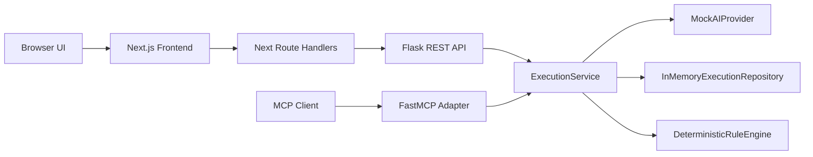

# CapabilityForge AI Architecture (Root Overview)

From natural-language intent to governed, executable AI capabilities.

This root architecture document is the short entry point.

The detailed architecture specification, sequence diagrams, and state model live in [docs/architecture.md](docs/architecture.md).

## Repository Structure

1. `frontend/` contains the Next.js marketplace UI and route handlers.
2. `backend/` contains Flask APIs, execution service, rule engine, and MCP adapter.
3. `docs/` contains architecture and architecture decision records.

## Runtime Model

1. Browser requests go to Next.js UI.
2. Next.js route handlers proxy capability execution calls to backend Flask APIs.
3. Flask REST and FastMCP both delegate to the same `ExecutionService`.
4. `ExecutionService` orchestrates provider, repository, and deterministic rule engine.

## Diagram Index

Use the canonical architecture diagrams in [docs/architecture.md](docs/architecture.md):

1. Component Diagram
2. Generation Request Sequence Diagram
3. Approval And Execution Sequence Diagram
4. MCP Invocation Sequence Diagram
5. State Lifecycle Diagram

## Ownership Notes

1. UI behavior and capability interaction patterns are documented in frontend component files and API route handlers.
2. Domain orchestration and execution guarantees are enforced in backend service and engine layers.
3. Architecture decisions and rationale are tracked in `docs/decisions`.

## Quick System Sketch

## Deployment Note

For Vercel deployment where the UI can execute real capability APIs, deploy `frontend` and `backend` as separate Vercel projects and set `BACKEND_API_URL` in the frontend project to the backend project URL.
