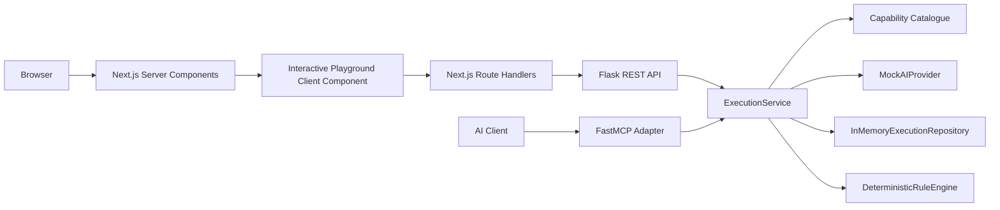

# Trusted Data AI Studio

Trusted Data AI Studio is a prototype of an enterprise AI capability marketplace where governed capabilities can be discovered and invoked through both a web application and MCP.

## Problem Statement

Data-quality rules are often written manually, which is slow and inconsistent. Unconstrained model-generated code can also introduce risk in enterprise environments. Teams need AI capabilities with clear contracts, governance, approval, repeatability, and observability.

## Prototype Scope

This prototype focuses on one complete vertical slice:

- Data Quality Rules capability
- Deterministic mock AI provider
- Human review before execution
- Deterministic rule execution engine
- Quality scorecard output
- Two invocation interfaces: REST and MCP

## Main User Journey

Discover capability
-> enter schema and requirements
-> generate candidate rules
-> approve or reject rules
-> execute approved rules
-> view quality scorecard

## Technology Stack

Frontend

- Next.js
- React
- TypeScript
- Tailwind CSS

Backend

- Python
- Flask
- pytest
- official Python MCP SDK with FastMCP

Architecture Patterns

- Server and Client Component boundaries in Next.js
- REST backend-for-frontend proxy route handlers
- backend service layer
- provider abstraction
- repository abstraction
- deterministic rule engine

## Architecture Diagram



REST and MCP both reuse the same ExecutionService.

Architecture documentation:

- Root overview: [ARCHITECTURE.md](ARCHITECTURE.md)
- Detailed diagrams and flows: [docs/architecture.md](docs/architecture.md)

## Responsibility Table

| Component | Responsibility |
| --- | --- |
| Next.js UI | capability discovery, rule review, sample record input, scorecard display |
| Next.js Route Handlers | thin server-side proxy between browser and Flask API |
| Flask Blueprints | HTTP adapters, request parsing, status mapping, structured error envelopes |
| ExecutionService | orchestration, validation, state transitions, provider invocation, scorecard assembly |
| capability catalogue | capability metadata and capability lookup |
| AIProvider | interface contract for rule-generation providers |
| MockAIProvider | deterministic candidate-rule generation from schema and requirement text |
| execution repository | persistence contract for execution records |
| deterministic rule engine | deterministic evaluation of approved rules over records |
| MCP adapter | tool interface that delegates directly to ExecutionService |

## Repository Structure

```text
aiStudio/
	backend/
		app/
			api/
			catalogue/
			providers/
			repositories/
			engines/
			services/
			mcp/
		tests/
		run.py
		requirements.txt
	frontend/
		src/
			app/
			components/
			data/
			lib/
		package.json
	docs/
		architecture.md
		decisions/
```

## Local Setup

Backend

```bash
cd backend
python3 -m venv .venv
source .venv/bin/activate
python -m pip install -r requirements.txt
python run.py
```

Frontend

```bash
cd frontend
npm install
npm run dev
```

Local URLs

- Flask API: http://127.0.0.1:5000
- Next.js app: http://localhost:3000
- Data Quality Rules capability page: http://localhost:3000/capabilities/data-quality-rules

## Testing

Backend

```bash
cd backend
.venv/bin/python -m pytest -v
```

Frontend

```bash
cd frontend
npm run lint
npm run build
```

Current verified backend result: 24 passing tests.

## Example Browser Workflow

Example columns

```text
customer_id, email, age, postal_code
```

Example requirements

```text
Email is required, age cannot be negative, and postal code must use a valid Canadian format.
```

Example sample records producing a 50 percent score

```json
[
	{
		"customer_id": "1001",
		"email": "john@example.com",
		"age": 32,
		"postal_code": "K1A 0B1"
	},
	{
		"customer_id": "1002",
		"email": "",
		"age": -4,
		"postal_code": "111 111"
	}
]
```

With approved rules email-required and age-minimum, one record passes and one fails, yielding 50.0 quality score.

## REST Examples

Generate candidate rules

```bash
curl -sS -X POST "http://127.0.0.1:5000/api/v1/capabilities/data-quality-rules/executions" \
	-H "Content-Type: application/json" \
	-d '{
		"datasetColumns": ["customer_id", "email", "age", "postal_code"],
		"requirements": "Email is required, age cannot be negative, and postal code must use a valid Canadian format."
	}'
```

Execute approved rules

```bash
curl -sS -X POST "http://127.0.0.1:5000/api/v1/executions/<execution_id>/execute" \
	-H "Content-Type: application/json" \
	-d '{
		"approvedRuleIds": ["email-required", "age-minimum"],
		"records": [
			{"customer_id": "1001", "email": "john@example.com", "age": 32},
			{"customer_id": "1002", "email": "", "age": -4}
		]
	}'
```

## MCP Usage

```bash
cd backend
source .venv/bin/activate
npx @modelcontextprotocol/inspector python -m app.mcp.server
```

Tool name:

- generate_data_quality_rules

Example arguments:

- dataset_columns: ["customer_id", "email", "age", "postal_code"]
- requirements: "Email is required, age cannot be negative, and postal code must use a valid Canadian format."

MCP is implemented as a thin adapter over the same ExecutionService used by REST.

## Quality And Responsible-AI Controls

- constrained structured rule schema
- deterministic mock provider
- authoritative backend validation
- human approval before execution
- deterministic application-controlled rule engine
- structured errors
- automated tests
- execution status and metadata

## Development Approach

- spec-driven development
- incremental vertical slices
- walking skeleton architecture
- test-driven development for deterministic backend behavior
- bounded use of GitHub Copilot for acceleration
- plan review, diff review, test verification, and focused commits

## Key Trade-Offs

| Current choice | Why it was suitable for the prototype | Production evolution |
| --- | --- | --- |
| mock provider | deterministic, fast, testable behavior without external model dependencies | add provider adapters for approved model platforms |
| in-memory repository | simple state handling for local demo and tests | move to persistent database storage |
| synchronous execution | reduced complexity for vertical-slice delivery | async execution workers and job orchestration |
| one capability | deep slice over breadth for implementation clarity | expand to versioned multi-capability catalog |
| local stdio MCP | easiest secure local integration path | managed MCP deployment and access controls |
| no authentication | keeps prototype focused on capability lifecycle | add authentication, authorization, and tenancy |

## Production Roadmap

- real provider adapters with policy controls
- structured-output validation and evaluation datasets
- persistent database and migration strategy
- authentication and authorization
- tenant isolation
- secrets management
- asynchronous workers
- retries and idempotency
- observability and cost metrics
- versioned capability manifests
- CI/CD and deployment automation

## Key Takeaways

- This is a platform design, not a prompt wrapper.
- REST and MCP share one service layer.
- AI proposes rules; deterministic application logic executes them.
- Quality is enforced architecturally through contracts, validation, and workflow controls.
