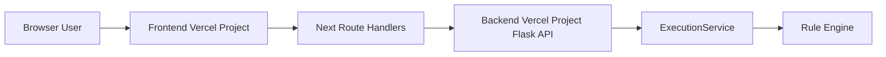

# Vercel Deployment: UI + Active Backend API

To keep the UI and real capability API active together in production, use two Vercel projects from the same repository:

1. Frontend project with root directory `frontend`
2. Backend project with root directory `backend`

Then wire the frontend proxy routes to backend using `BACKEND_API_URL`.

## Why Two Projects

The frontend route handlers in:

1. `frontend/src/app/api/capabilities/[id]/executions/route.ts`
2. `frontend/src/app/api/executions/[executionId]/execute/route.ts`

forward requests to `${BACKEND_API_URL}/api/v1/...`.

If only the frontend project is deployed, those routes return `backend_unavailable` unless `BACKEND_API_URL` points to a running backend.

## 1) Deploy Backend Project

1. In Vercel, add a new project from the same repository.
2. Set Root Directory to `backend`.
3. Vercel uses `backend/vercel.json` to route requests to `run.py` with `@vercel/python`.
4. Deploy and copy backend URL, for example:
	`https://aistudio-backend.vercel.app`

## 2) Deploy Frontend Project

1. Add another Vercel project from the same repository.
2. Set Root Directory to `frontend`.
3. Add environment variable in Project Settings:
	- `BACKEND_API_URL=https://aistudio-backend.vercel.app`
4. Redeploy frontend.

## 3) Verify End-to-End

1. Open frontend URL and run the Data Quality Rules flow in the UI.
2. Verify frontend API proxy endpoints:
	- `/api/capabilities/data-quality-rules/executions`
	- `/api/executions/<execution_id>/execute`
3. Verify backend health endpoint directly on backend URL:
	- `/api/v1/health`

## Optional: Custom Domains

You can keep a clean split with:

1. `app.yourdomain.com` -> frontend project
2. `api.yourdomain.com` -> backend project

Set `BACKEND_API_URL=https://api.yourdomain.com` in frontend.

## Quick Troubleshooting

1. If UI calls fail with `backend_unavailable`, confirm `BACKEND_API_URL` is set in frontend project settings.
2. If backend deploy is healthy but requests fail, verify backend root directory is `backend` and `vercel.json` is detected.
3. After changing environment variables, trigger a frontend redeploy.

## Diagram: Deployed Request Path

## Single-Project Note

A frontend-only Vercel project can still expose frontend-owned routes (such as `/api/v1/health` in Next.js), but that is not the same as deploying and running the Flask backend capability API.
