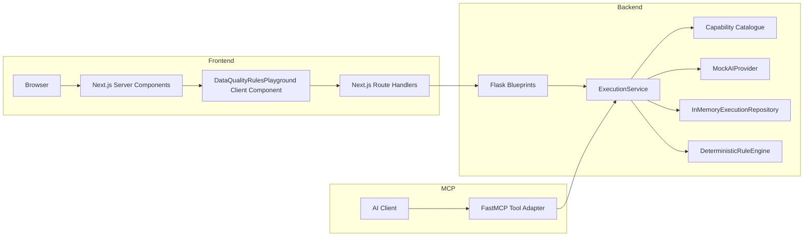
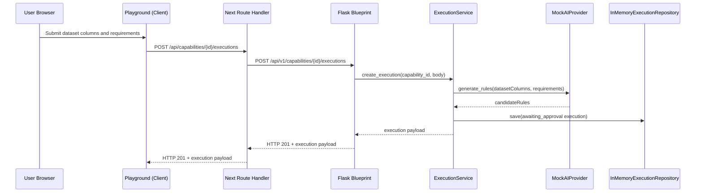
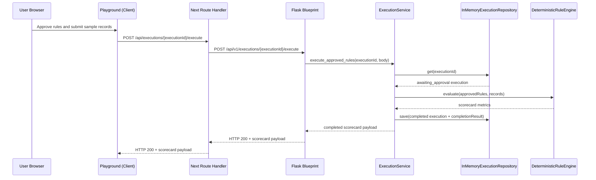
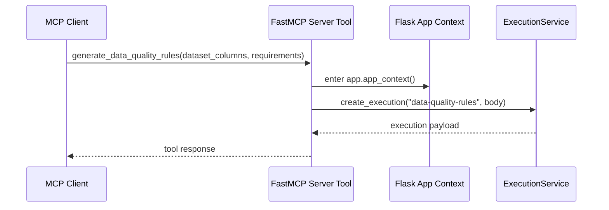
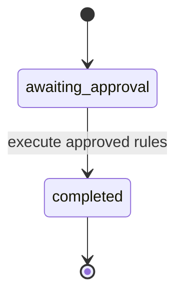

# Trusted Data AI Studio Architecture

## 1. Context And Goals

Trusted Data AI Studio demonstrates a governed enterprise AI capability pattern. The goal is to show one complete vertical slice where:

- capabilities can be discovered in a marketplace UI
- candidate rules can be generated from schema and requirements
- humans approve or reject generated rules
- approved rules execute deterministically on sample records
- results are surfaced as a quality scorecard
- the same backend service is invoked by REST and MCP adapters

## Diagram Catalog

This document includes five diagrams in this order:

1. Component Diagram
2. Generation Request Sequence Diagram
3. Approval And Execution Sequence Diagram
4. MCP Invocation Sequence Diagram
5. State Lifecycle Diagram

## 2. Component Diagram

## 3. Generation Request Sequence Diagram

## 4. Approval And Execution Sequence Diagram

## 5. MCP Invocation Sequence Diagram

## 6. State Lifecycle

- New executions are persisted as awaiting_approval.
- Successful rule execution transitions status to completed.
- Re-execution of a completed execution returns execution_already_completed.

## 7. Dependency Direction

Dependency direction is strictly inward from adapters toward core orchestration:

- UI, REST handlers, and MCP adapter depend on ExecutionService
- ExecutionService depends on abstractions and deterministic collaborators:
  - capability catalogue lookup
  - provider abstraction
  - repository abstraction
  - rule engine
- Rule engine is independent of Flask, HTTP, and repository concerns

## 8. Error Boundaries

Frontend:
- client-side validation provides immediate feedback
- route handlers return structured backend_unavailable on network failures

REST boundary:
- Blueprints parse JSON and map domain exceptions to HTTP status codes
- structured error envelope with code and message

Service boundary:
- authoritative validation for generation and execution inputs
- lifecycle guardrails (unknown execution, already completed)

MCP boundary:
- tool catches known service errors and returns controlled readable failures

## 9. Test Strategy

Primary verification focuses on deterministic backend behavior using pytest:

- generation contract and validation
- execution persistence and retrieval
- deterministic evaluation for required, minimum, and format rules
- scorecard correctness and state transition constraints
- MCP tool tests for valid input, controlled invalid input, and service reuse

Current verified state: full backend suite passes with 24 tests.

## 10. Production Scaling Considerations

- replace in-memory repository with persistent data store
- add queue-based asynchronous execution for larger datasets
- introduce retries, idempotency keys, and timeout policies
- add authentication, authorization, and tenant isolation
- add provider routing, policy enforcement, and output validation
- add observability for latency, errors, usage, and cost telemetry
- introduce capability versioning and change-management workflows
